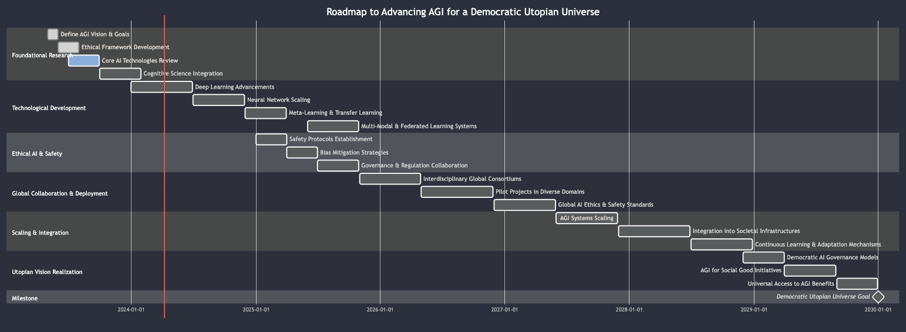

# AI Research Keywords Checklist

Use this checklist to track your research and exploration into various AI topics.

## Core Concepts and Techniques

- [ ] Artificial General Intelligence (AGI)
- [ ] Hierarchical Reinforcement Learning (HRL)
- [ ] Transfer Learning
- [ ] Meta-Learning
- [ ] Multi-Modal Learning Systems
- [ ] Federated Learning
- [ ] Evolutionary Computation
- [ ] Deep Learning
- [ ] Neural Network Scaling
- [ ] Cognitive Architectures
- [ ] Continuous Learning / Lifelong Learning
- [ ] Zero-Shot Learning / Few-Shot Learning
- [ ] Self-Supervised Learning
- [ ] Cross-Domain Generalization

## Specialized Areas and Approaches

- [ ] Natural Language Understanding (NLU)
- [ ] Generative Adversarial Networks (GANs)
- [ ] Reinforcement Learning with Human Feedback (RLHF)
- [ ] Decision Making Under Uncertainty
- [ ] Explainable AI (XAI)
- [ ] Neurosymbolic AI / Hybrid AI
- [ ] Human-in-the-loop AI
- [ ] Adversarial Machine Learning
- [ ] Domain Adaptation
- [ ] Synthetic Data Generation
- [ ] Bias Detection and Mitigation in AI
- [ ] Safe AI and AI Safety
- [ ] AI Ethics and Governance

## Technologies and Frameworks

- [ ] OpenAI GPT (and versions, e.g., GPT-3, GPT-4)
- [ ] Google BERT, T5, and other Transformer models
- [ ] DeepMind’s AlphaGo, AlphaZero
- [ ] Multi-Agent Systems

## Applications and Implications

- [ ] AI for Social Good
- [ ] AI in Healthcare
- [ ] Autonomous Systems and Robotics
- [ ] AI and Creativity
- [ ] Human-AI Collaboration
- [ ] Augmented Intelligence

## Research and Community Resources

- [ ] Preprints and Publications: arXiv, AAAI, NeurIPS, ICLR, CVPR, EACL, ACL
- [ ] Organizations and Journals: Association for the Advancement of Artificial Intelligence (AAAI), International Journal of Machine Learning and Cybernetics, Journal of Artificial Intelligence Research (JAIR)
- [ ] Conferences: Conference on Neural Information Processing Systems (NeurIPS), International Conference on Learning Representations (ICLR), International Conference on Machine Learning (ICML), IEEE Conference on Computer Vision and Pattern Recognition (CVPR), Annual Meeting of the Association for Computational Linguistics (ACL)

<!-- ### Mermaid Syntax Gantt Chart

gantt
title Roadmap to Advancing AGI for a Democratic Utopian Universe
dateFormat YYYY-MM-DD
section Foundational Research
Define AGI Vision & Goals :done, 2023-05-01, 30d
Ethical Framework Development :done, 2023-06-01, 60d
Core AI Technologies Review :active, 2023-07-01, 90d
Cognitive Science Integration : 2023-10-01, 120d
section Technological Development
Deep Learning Advancements : 2024-01-01, 180d
Neural Network Scaling : 2024-07-01, 150d
Meta-Learning & Transfer Learning : 2024-12-01, 120d
Multi-Modal & Federated Learning Systems : 2025-06-01, 150d
section Ethical AI & Safety
Safety Protocols Establishment : 2025-01-01, 90d
Bias Mitigation Strategies : 2025-04-01, 90d
Governance & Regulation Collaboration : 2025-07-01, 120d
section Global Collaboration & Deployment
Interdisciplinary Global Consortiums : 2025-11-01, 180d
Pilot Projects in Diverse Domains : 2026-05-01, 210d
Global AI Ethics & Safety Standards : 2026-12-01, 180d
section Scaling & Integration
AGI Systems Scaling : 2027-06-01, 180d
Integration into Societal Infrastructures : 2027-12-01, 210d
Continuous Learning & Adaptation Mechanisms : 2028-07-01, 180d
section Utopian Vision Realization
Democratic AI Governance Models : 2028-12-01, 120d
AGI for Social Good Initiatives : 2029-04-01, 150d
Universal Access to AGI Benefits : 2029-09-01, 120d
section Milestone
Democratic Utopian Universe Goal :milestone, 2030-01-01, 1d -->

# The AGI Progression Timeline

## 1950

### Conceptual Inception of Artificial Intelligence

Alan Turing publishes "Computing Machinery and Intelligence," proposing the Turing Test as a criterion of intelligence.

- **Reflection:** Turing's paper represents a monumental leap towards AGI, akin to the first steps of a marathon. The starting gun has been fired, setting us on a path that leads to "midnight."

## 1956

### Birth of AI as a Field of Study

The Dartmouth Conference takes place, coining the term "Artificial Intelligence."

- **Reflection:** The coining of the term "Artificial Intelligence" is a foundational moment that cements AI's place in academic and research communities, accelerating our journey towards "midnight."

## 1966

### Early Natural Language Processing

ELIZA, an early natural language processing computer program, is created.

- **Reflection:** ELIZA's ability to mimic human conversation, however primitive, marks a small but significant tick towards "midnight," showcasing the potential for machines to interact with us on our terms.

## 1974

### The First AI Winter

Pessimism about AI's lofty goals leads to a reduction in funding and interest.

- **Reflection:** This period serves as a reminder of the challenges ahead. Although it momentarily slows our pace, it strengthens the resolve to push closer to "midnight."

## 1980

### Revival of Interest in AI

New algorithms and the success of expert systems end the first AI winter.

- **Reflection:** This resurgence in AI interest reinvigorates the field, renewing momentum in our countdown to "midnight" as practical applications emerge.

## 1997

### Defeating a World Chess Champion

IBM's Deep Blue defeats Garry Kasparov, demonstrating AI's potential in specific tasks.

- **Reflection:** Deep Blue's victory is a stark indication of AI's potential, bringing the hands of the clock significantly closer to "midnight" as AI begins to rival human expertise.

## 2000

### Internet and Data Availability

The second AI winter fades as the internet provides data for machine learning.

- **Reflection:** The dawn of the internet age floods AI with data, propelling us toward "midnight" as the potential for machine learning becomes clear.

## 2012

### Advancements in Deep Learning

AlexNet wins the ImageNet challenge, sparking a deep learning revolution.

- **Reflection:** This victory is a quantum leap towards "midnight," signaling deep learning as a transformative force in AI's progression.

## 2015

### Mastery Over Complex Strategy Games

AlphaGo defeats a professional human Go player, overcoming a complex strategic challenge.

- **Reflection:** AlphaGo's triumph is a testament to AI's strategic evolution, marking a significant step in the advancement towards "midnight."

## 2018

### Large Language Models

The development of GPT-2 by OpenAI, capable of generating human-like text.

- **Reflection:** GPT-2's linguistic abilities showcase AI's growing understanding of human language, nudging us ever closer to "midnight."

## 2020

### Superior Performance in Complex Tasks

AI systems begin to outperform humans in diverse areas such as driving and medical diagnosis.

- **Reflection:** This milestone signifies AI's encroachment into domains once thought uniquely human, edging us closer to "midnight" with a blend of awe and trepidation.

## 2022

### Advancements in Self-Learning and Adaptability

AI systems demonstrate the ability to learn new tasks without human intervention and adapt to changing environments.

- **Reflection:** This marks a significant step closer to AGI, as machines start displaying signs of independent problem-solving, reducing the time to "midnight" on the AGI clock.

## 2023

### Mainstreaming of Generative AI Technologies

Generative AI technologies become widespread, affecting the economy and society.

- **Reflection:** This boom in AI capabilities represents a sprint towards "midnight," as AI begins to permeate every aspect of life and business, showcasing a remarkable leap in the AI's evolution.

## 2024

### Establishment of the International AGI Ethics Board

The creation of a body to guide the ethical development of AGI as we approach the threshold of AGI.

- **Reflection:** The establishment of an ethics board is a crucial checkpoint, signifying the maturity of the field as we edge towards "midnight" with caution and responsibility.

## 2025

### Response to Commercialization Challenges

The AI community forms international collaborations to ensure that AI advances serve the common good.

- **Reflection:** This response to the swift commercial expansion of AI brings us closer to a responsible "midnight," ensuring that when AGI arrives, it does so with a foundation of ethical principles.

## 2026

### Cognitive Architectures and Ethical Design

AI is designed with the ability for self-improvement and ethical decision-making.

- **Reflection:** The creation of self-improving AI that considers ethics narrows the gap to "midnight," signifying a profound advance towards AGI that is not only intelligent but also aligns with human values.

## 2030

### The Achievement of the Singularity

An AGI system achieves an intellectual capacity beyond human comprehension, capable of recursive self-improvement.

- **Reflection:** The singularity represents the final minute to "midnight," where AGI has the potential to either be the pinnacle of our achievements or a catalyst for an unforeseen future.
